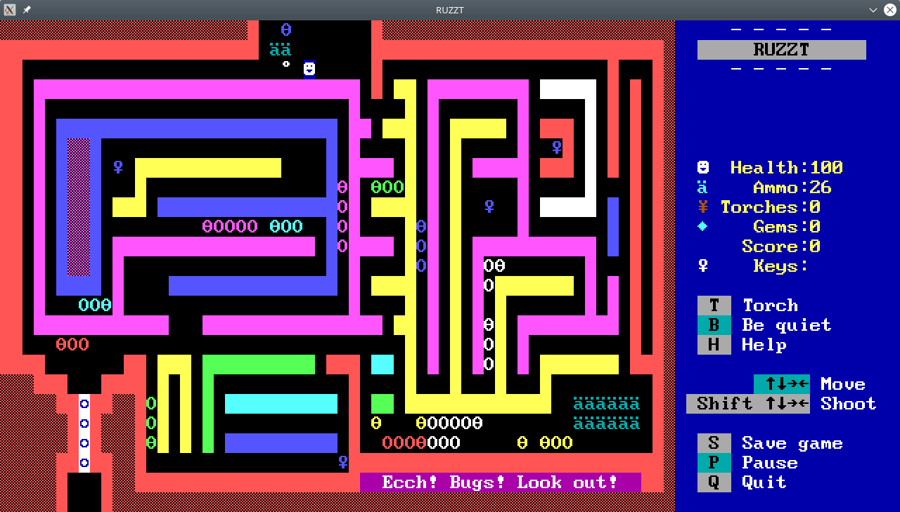

# RUZZT

A clone of the DOS game "ZZT", written in the [Rust](https://rust-lang.org) programming language.

My wife and I wrote this as a fun exercise, and went a lot further with it than originally
anticipated. We wanted to try to replicate the original game's behaviour by simply looking at it
running in Dosbox and seeing if we could make RUZZT do the same thing. This means the code
architechure is likely very different from the original game.

Eventually we did get far enough that it seemed like a waste of time to try to guess how some
specific things were implemented, so we used a disassembler to make sure various behaviours worked
correctly.

## Building

1. Clone the repository.
2. Install the Rust compiler ([Rust](https://rust-lang.org)).
3. Since this project uses the `sdl2` crate, you will need to install SDL2 aswell. Follow the
   instructions in the [sdl2 crate README](https://github.com/Rust-SDL2/rust-sdl2).
4. In the root directory of the repository:
   - `cd ruzzt`
   - `cargo run` (Note that `cargo` is shipped with the main Rust installer)

Note that you will probably want to download the original game and copy the .ZZT world files into
the folder where you run `cargo run`, so that they show up in the world selection list
(you can download it from [The Museum of ZZT](https://museumofzzt.com/zzt)).

## Goals

* Replicate the behaviour of the original game as closely as possible.
* Use only safe Rust APIs.
* Use only logic and basic data structures and avoid memory tricks like Cell.
* Make the game logic modular where it makes sense, so that parts of the engine can be reused for
  possible future ZZT front-end variants.
* Make the code as "rustic" as possible.

## Non-goals

* Anything related to out-of-bounds array access or reading random unexpected memory is considered
  out-of-scope for this project.
* If something depends on a tile's appearance on the screen not being updated to the game's current
  state, then that behaviour is not considered at the current time. For example, in original ZZT,
  a centipede that has just turned around will not be redrawn immediately, so you don't see the head
  appearing at the end of the tail until it moves by one tile.
* Super ZZT simulation support (although, SZT files should be able to be loaded via the
  zzt_file_format crate).

## Status

RUZZT can be used to play most ZZT worlds correctly, including:
* TOWN.ZZT
* The fractal generator from
  [PREPOSTM.ZZT](https://museumofzzt.com/file/p/prepostm.zip?file=PREPOSTM.ZZT)
  (this can be made to run to completion in 10 minutes if you take out all the sleeps in the code)
* And probably a whole bunch of other stuff we haven't tested.

Known issues include:
* Missing game speed control feature
* Missing world editor (probably out of scope)
* Missing high score system
* Bomb+Conveyor bug doesn't work.
  - This is where you try to activate a bomb that is rotating around a conveyor, and it displays a
    bunch of random characters then causes both the player and the bomb to disappear, breaking the
    game.
* Severe lack of unit tests (at least there's a couple so far, better than nothing).
* Several instances of "TODO" in the code.
* And more!

## Crates

* `ruzzt` - This is the main game executable. It defines how characters are drawn on the screen, and
  how sounds are played.
* `ruzzt_engine` - This is a library that can be used to simulate ZZT worlds. This module is
  intended to be easily reusable for any ZZT front end. For example, you could go ahead and adapt
  this for your own 3D ZZT clone.
* `zzt_file_format` - This is a library that can read and write ZZT and SZT worlds. It supports
  [serde](https://serde.rs/), so you can easily serialise and deserialise ZZT worlds to other
  formats.
* `zzt_to_json` - This is a simple command-line executable that uses the `zzt_file_format` to
  facilitate conversion between ZZT and JSON files.
* `zzt_web_editor` - This is a work-in-progress ZZT world editor that runs in a web browser using
  `ruzzt_engine` to load and render worlds, compiles to WASM.

## Architecture

The main game simulation is in the `ruzzt_engine` crate. See `main.rs` in the `ruzzt` module for an
idea of how to use it. Maybe I'll expand this section later.
